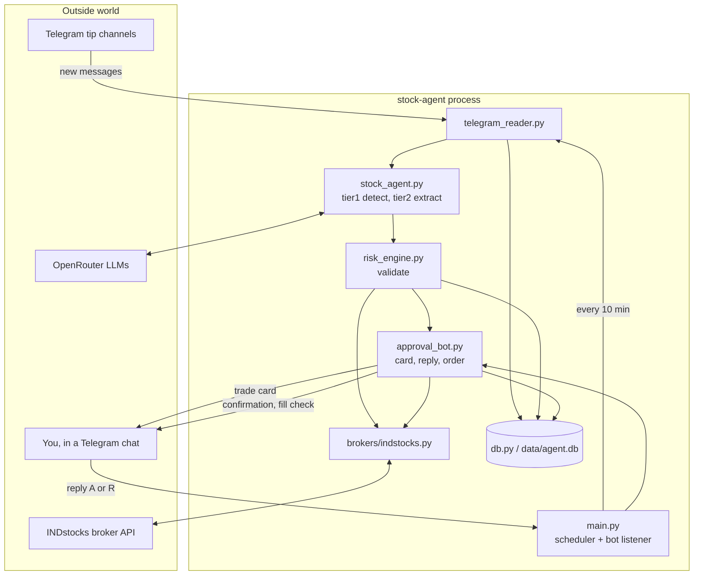

# sanikaStocks — How It Works

## What it does

Watches Telegram channels where people post stock tips, works out which messages are real tips, turns them into concrete orders, asks you to approve over Telegram, and places the order with your broker if you say yes.

Nothing gets bought without you replying `A`.

One long-running Python process. All async. A SQLite file is its memory.

---

## The flow

### Step by step

1. Every 10 minutes, the scheduler wakes up the poll loop.
2. `telegram_reader` fetches messages newer than the last one it saw, up to 10 per channel.
3. Each new message is saved to SQLite. Duplicates are dropped right here.
4. Tier 1 LLM: "is this a tip?" Cheap model, one question.
5. Tier 2 LLM: extract symbol, entry range, stop loss, targets. Bigger model, only runs if tier 1 said yes.
6. `risk_engine` checks the symbol is real, the signal is fresh, it's not a repeat, and you're under the daily cap. Then works out quantity.
7. `approval_bot` builds a trade card and sends it to your Telegram chat.
8. You reply `A` or `R`.
9. On `A`: re-check market hours, balance, and live price, then place a limit order.
10. Confirmation sent. A background job checks for 10 minutes that the order actually filled.

---

## Module by module

### config.py

- Reads everything from `.env` at import time.
- Crashes immediately if a required secret is missing, so you find out at startup, not mid-trade.
- Trading knobs and their defaults:

| Setting | Default | Meaning |
|---|---|---|
| `DEFAULT_STOP_LOSS_PCT` | 15 | Used when the tipster didn't give a stop loss |
| `FIXED_ALLOCATION_AMOUNT` | 5000 | Rupees per trade |
| `MAX_SIGNAL_AGE_MINUTES` | 60 | Older signals are ignored |
| `POLL_INTERVAL_MINUTES` | 10 | How often channels are checked |
| `MAX_DAILY_TRADES` | 5 | Daily cap |

### main.py — the runtime

Startup order matters:

1. Open SQLite, create tables.
2. Check for a broker rate-limit cooldown file. If it's still fresh, exit quietly so a restart loop can't hammer the broker's login endpoint.
3. Authenticate with the broker. Three attempts, growing delays.
4. Start the Telegram bot client.
5. Start the Telegram user-account client. If that session is dead, carry on with polling disabled and say so, because the bot half still works.
6. Rebuild the map of pending trade cards from the database.
7. Register one message handler for the approval chat.
8. Start two scheduled jobs.

The two jobs:

- The poll loop, every 10 minutes.
- A 9:15 IST job that re-sends every pending card with fresh prices when the market opens.

`poll_channels` is the whole pipeline in one function. For each new message it pulls the last 5 messages from the same channel as context, runs the LLM, saves the signal, validates it, fetches your balance and holdings, saves a trade candidate, formats a card, sends it. The body is wrapped so one bad message can't kill the loop, and the error is sent to you on Telegram rather than only landing in the logs.

Bot commands:

- `/status` — pings the broker and OpenRouter, reports the last poll
- `/pending` — re-sends all pending cards with live prices
- `/cancel SYMBOL` — cancels a pending trade
- `/costs` — LLM usage and spend
- `/help`

### telegram_reader.py — 34 lines, one job

- Looks up the highest message id already seen per channel, asks for messages after that, capped at 10, oldest first.
- With no history it grabs the newest 10, not the whole channel backlog.
- Truncates text to 1000 characters.
- Hands each message to `save_message`, which uses `INSERT OR IGNORE`.

That insert is the dedup gate. If the row already existed, nothing comes back and the message never enters the pipeline. Two overlapping runs can't double-process.

### stock_agent.py — the two-model pipeline

The split exists to save money.

**Tier 1** gets a small cheap model and one question: is this a tip, how sure are you. Its prompt explicitly rules out "hold", "book profits" and "trail SL", which are the noisiest thing in these channels. Below 0.6 confidence the message stops here and the expensive model never runs.

**Tier 2** gets the bigger model, the message, and recent channel context. It must return a fixed JSON shape: symbol, exchange, action, entry range, stop loss, targets, confidence, reasoning.

The validation after tier 2 earns its keep:

- Strips markdown fences the model wasn't supposed to add.
- `action` must be BUY or SELL.
- `exchange` must be NSE or BSE.
- Both entry prices must be positive numbers.
- `confidence` must be between 0 and 1.
- `targets` filtered down to plausible numbers.
- If `entry_min` came back above `entry_max`, they're swapped rather than rejected.
- Anything else failing returns `None` and the message is dropped.

An LLM will happily invent `"action": "ACCUMULATE"`. This is where that dies.

Every call records tokens and cost into `api_costs`, which is what `/costs` reads.

### risk_engine.py — decides whether a signal becomes a real order

**Symbol resolution**, in order: exact match, uppercase, spaces and hyphens stripped, then fuzzy match at 0.8 similarity. "Reliance Industries" has to become the exact tradeable symbol or the signal is rejected. Unresolved means rejected, never guessed.

**The gates**, in order:

1. Fill in a default stop loss if there isn't one.
2. Reject signals older than an hour.
3. Reject a symbol this channel already gave you in the last 24 hours.
4. Reject once you've hit the daily trade cap.

**Sizing** splits by direction:

- SELL uses the quantity you actually hold. Rejected outright if you hold nothing.
- BUY divides ₹5000 by the entry price and floors it.
- If that comes out under one share, there's a deliberate escape hatch: buy a single share as long as the price is under ₹10,000. A good tip on an expensive stock isn't thrown away, but a ₹50,000 share is still refused.

Returns a `ValidationResult` carrying everything downstream needs.

### approval_bot.py — the human loop and the order

**The card** shows entry range, live price, stop loss and each target as a percentage move from the current price, quantity, amount, wallet, signal age, and the original tip with URLs stripped. A SELL for something you don't hold is labelled "No action - not in portfolio" rather than hidden.

**On approve**, everything gets re-checked rather than trusted from the card:

1. Is the market open (weekday, 9:15–15:30 IST)?
2. Is the broker reachable?
3. Is there enough money?
4. What's the price right now?

**If the price drifted** outside the original entry range, it neither refuses nor buys. It rewrites the candidate's entry range to a tight band around the new price, sends you a fresh "PRICE CHANGED" card, and waits for a second approval. You never get filled at a price you didn't see.

**Just before placing**, it re-reads the candidate's status from the database. Two `A` replies arriving close together can't both place an order, because the second finds the status is no longer pending.

**The order** is a limit order priced 0.2% above the live price for a buy, 0.2% below for a sell. Fills without a market order's slippage. It notes how much you held beforehand, then writes the audit log and the trade row. On a SELL it looks up the matching open BUY and closes it, which is what produces P&L, and the confirmation includes it.

**One failure gets special handling.** If the order goes through but the database write fails, it logs at critical, gives you the order id, and says explicitly not to re-approve. That's the one case where retrying would buy twice.

**Then** `verify_order_fill` runs in the background, checking your positions once a minute for ten minutes. It tells you either that the order filled, or that it couldn't confirm and you should check the broker yourself.

### db.py — every SQL statement, no ORM

Seven tables tracing the full chain:

| Table | Holds |
|---|---|
| `messages` | Raw Telegram messages. Unique on channel + message id |
| `signals` | What the LLM extracted |
| `trade_candidates` | What was offered to you, plus the Telegram message id so approvals survive a restart |
| `decisions` | Your approve/reject, and the price at that moment |
| `trades` | Open, then closed, with P&L computed on close |
| `audit_log` | Raw request and response for each order. Purged after 90 days |
| `api_costs` | LLM tokens and spend per call |

Two queries worth knowing:

- `get_today_trade_count` shifts SQLite's UTC clock forward 5:30, takes the start of that day, then shifts back. The daily cap has to reset at Indian midnight, not UTC midnight.
- `get_symbol_pnl` walks back to the most recent closed BUY and sums from there. Re-buying a stock you've traded before starts fresh P&L rather than dragging in last year's.

### brokers/

- `base.py` — the contract. Five async methods, four dataclasses (`Quote`, `Order`, `OrderResult`, `Position`).
- `indstocks.py` — the implementation.
  - Login is a TOTP code from a stored secret plus your MPIN, exchanged for a token.
  - Every request goes through one `_request` wrapper: re-authenticates once on a 403 and retries, raises `RateLimitError` on a 429 carrying the retry-after value. That's what `main.py` turns into the cooldown file.
  - The instrument list is a CSV of thousands of rows, cached for a day.
  - Quotes are throttled to one every half second.

### market_data.py

A yfinance fallback quote source. It exists, but nothing in the live path calls it — the pipeline uses the broker directly.

---

## Around the code

- **Docker** — Dockerfile plus compose file mounting `./data`, so the database and Telegram session outlive the container. Restarts at most three times on failure.
- **Infra** — Terraform in `infra/` provisions an Oracle Cloud VM; a cloud-init script sets it up.
- **Tests** — 88 pytest cases across 8 files, async mode on by default.

---

## The bits worth knowing

**Three separate things stop a duplicate order**, at three different layers:

1. The unique index on `messages`.
2. The 24-hour same-symbol check in the risk engine.
3. The status re-read right before placing.

**Approvals survive restarts.** They're keyed by Telegram message id and stored in the database, so restarting mid-approval doesn't orphan a card.

**Nothing is trusted from the tip to the order.** The LLM's fields are validated, its symbol is resolved against the broker's real instrument list, and the price is re-fetched at approval time.

**The one real single point of failure** is `data/agent.db`. Nothing backs it up.
